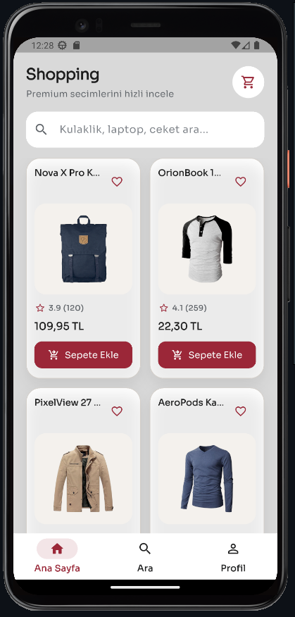
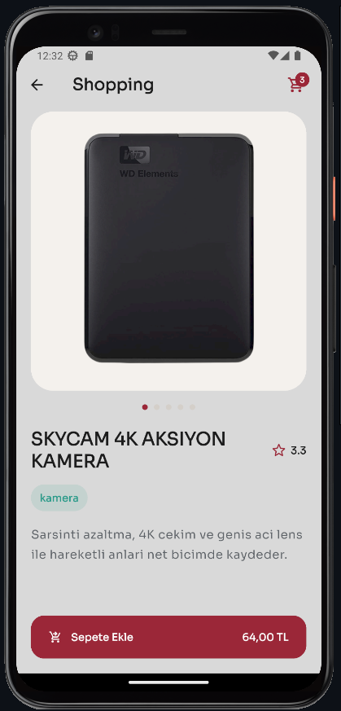
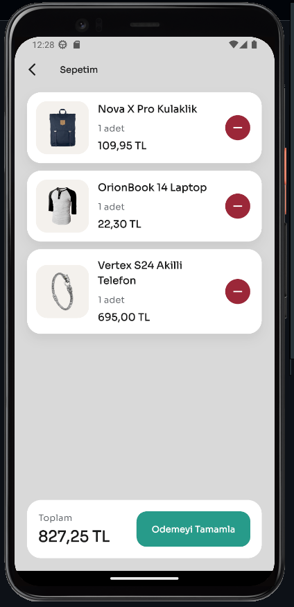
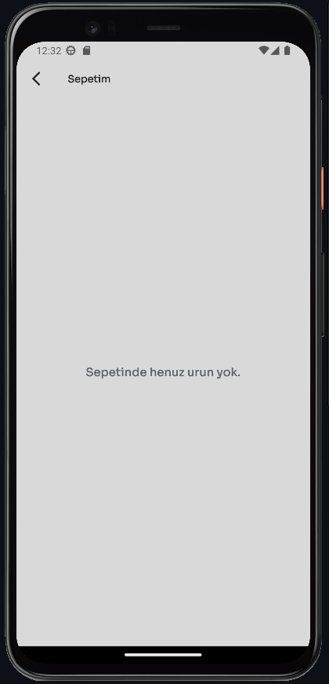

# Shopping

`Shopping`, Flutter ile gelistirilmis mobil bir alisveris uygulamasi arayuzudur. Uygulama, `Fake Store API` verilerini kullanir ve teknoloji odakli bir katalog deneyimi sunar.

## Kullanilan Flutter Surumu

- Flutter: `3.41.2`
- Dart: `3.11.0`

## Ozellikler

- Solda marka adi, sagda sepet ikonu bulunan ozel ust alan
- Ustte genis arama kutusu
- Iki kolonlu mobil urun listesi
- Urun detay ekrani
- Sepet ekleme ve sepetten azaltma akisi
- Altta `Odemeyi Tamamla` butonu
- Ozel tema renkleri ve Material 3 yapisi

## Ekran Goruntuleri

### Home



### Details



### Cart



### Empty Cart



## Veri Kaynagi

- API: `https://fakestoreapi.com/products`

Not:

- Urun adlari, kategorileri ve aciklamalari uygulama icinde teknoloji urunleri olarak uyarlanmistir.
- Gorseller API'nin orijinal urun gorsellerinden gelmektedir.

## Proje Yapisi

```text
lib/
  components/
    product_card.dart
  models/
    product_model.dart
  services/
    api_service.dart
  views/
    cart_screen.dart
    home_screen.dart
    product_detail_screen.dart
  main.dart
```

## Kullanilan Paketler

- `http`
- `google_fonts`

## Calistirma Adimlari

```bash
flutter pub get
flutter run
```

## Gelistirme Kontrolleri

```bash
flutter analyze
flutter test
```
